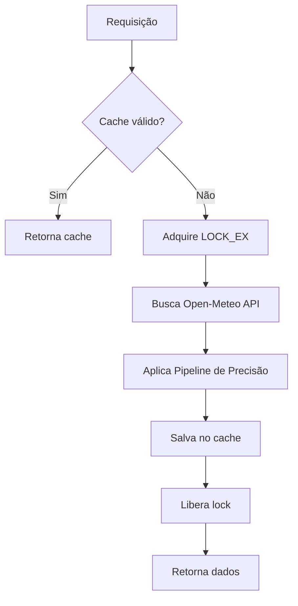
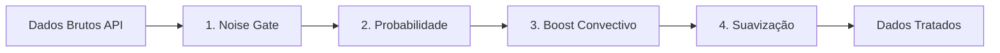
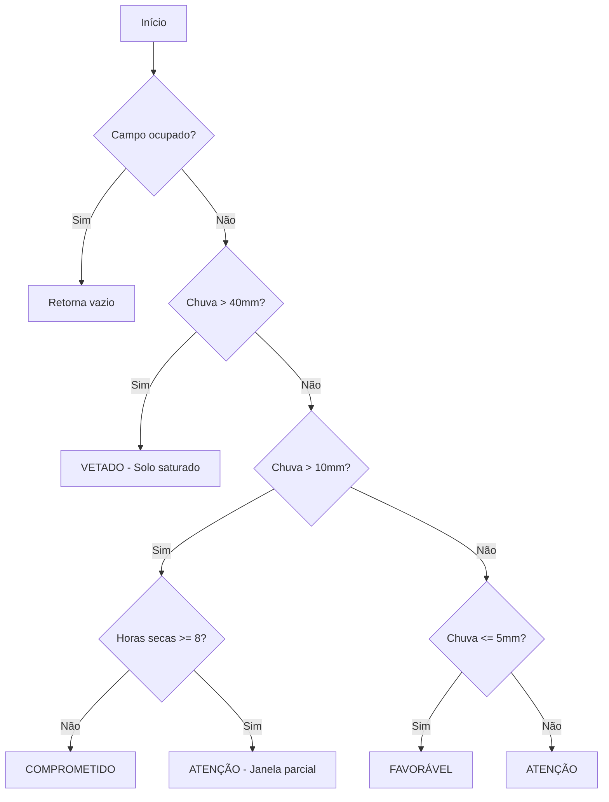
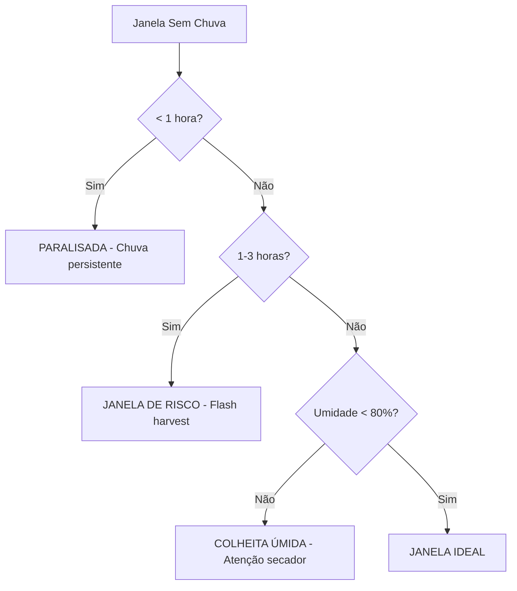
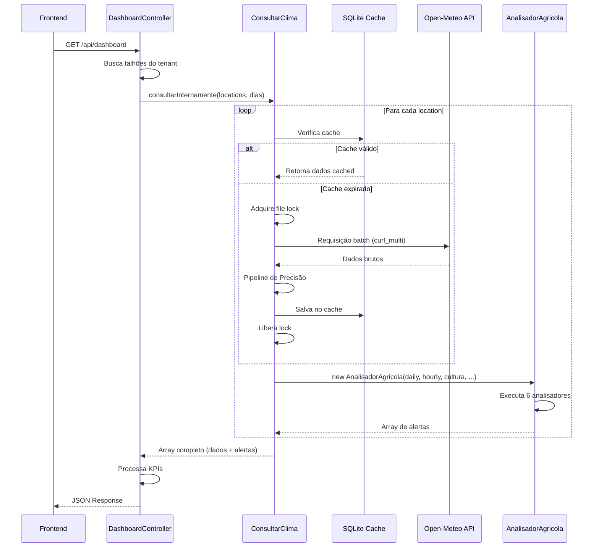
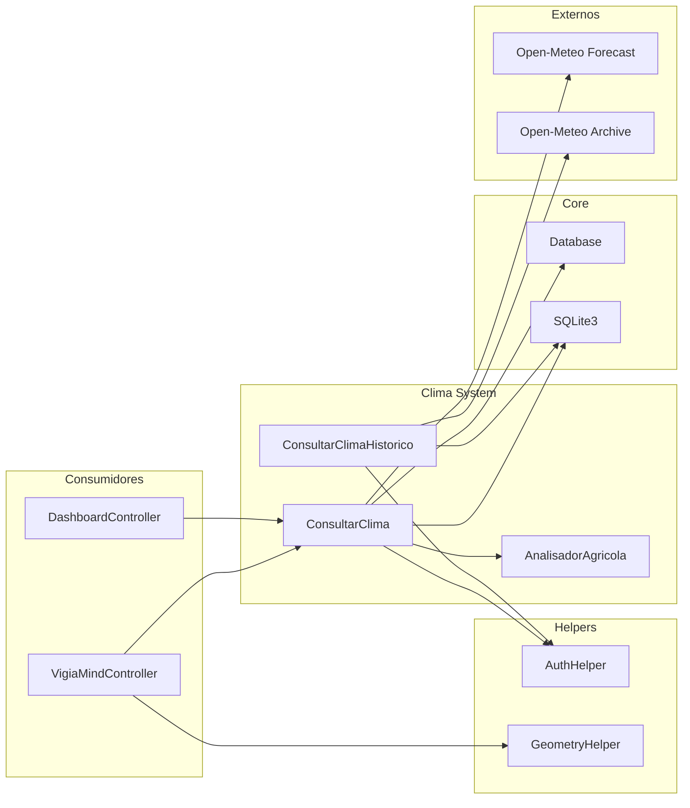

# Sistema de Análise Climática (AnalisadorClima) - Documentação Técnica

Este documento detalha o funcionamento completo do sistema de análise climática do VigiaSafra, incluindo a arquitetura, pipeline de processamento, motores de decisão agrícola e integrações.

---

## 1. Visão Geral da Arquitetura

O sistema climático é composto por três controllers principais que trabalham em conjunto para fornecer dados meteorológicos processados e alertas agronômicos inteligentes.

### Diagrama de Arquitetura

```mermaid
graph TB
    subgraph "Consumidores"
        VM[VigiaMindController]
        DB[DashboardController]
        FE[Frontend - AJAX]
    end

    subgraph "Clima Controllers"
        CC[ConsultarClima]
        AA[AnalisadorAgricola]
        CH[ConsultarClimaHistorico]
    end

    subgraph "APIs Externas"
        OM[Open-Meteo API]
        AR[Archive API]
    end

    subgraph "Cache Layer"
        SQ[(SQLite Cache)]
        LK[File Locking]
    end

    subgraph "Sessão / Config"
        TS[Tenant Settings]
        TL[Tenant Limits]
    end

    VM -->|consultarInternamente()| CC
    DB -->|consultarInternamente()| CC
    FE -->|POST /api/clima| CC
    FE -->|GET /api/climahistorico| CH

    CC -->|Busca previsão| OM
    CC -->|Instancia| AA
    CH -->|Busca histórico| AR

    CC <-->|Read/Write| SQ
    CH <-->|Read/Write| SQ
    CC -->|LOCK_EX| LK

    CC -->|Lê config de análise| TS
    CC -->|Aplica limites| TL
    AA -->|Parâmetros por cultura| TS
```

---

## 2. Estrutura de Arquivos

### Controllers (`application/controllers/Api/v1/clima/`)

| Arquivo | Classe | Responsabilidade |
|---------|--------|-----------------|
| [ControllerApiClima.php](file:///c:/xampp/htdocs/agrotech/application/controllers/Api/v1/clima/ControllerApiClima.php) | `ConsultarClima` | Gateway principal - Cache, API, Pipeline de processamento |
| [ControllerAnalisadorClima.php](file:///c:/xampp/htdocs/agrotech/application/controllers/Api/v1/clima/ControllerAnalisadorClima.php) | `AnalisadorAgricola` | Motor de BI - Gera alertas agronômicos |
| [ControllerApiClimaHistorico.php](file:///c:/xampp/htdocs/agrotech/application/controllers/Api/v1/clima/ControllerApiClimaHistorico.php) | `ConsultarClimaHistorico` | Dados históricos para análise retroativa |

### Roteamento (`application/controllers/Api/v1/routes/_task.php`)

```php
$routes = [
    'clima'          => 'ConsultarClima',
    'climahistorico' => 'ConsultarClimaHistorico',
    // ...
];
```

---

## 3. ConsultarClima - Gateway Principal

**Arquivo:** [ControllerApiClima.php](file:///c:/xampp/htdocs/agrotech/application/controllers/Api/v1/clima/ControllerApiClima.php)

### 3.1 Constantes de Configuração

```php
private const CANONICAL_FORECAST_DAYS = 14;
private const TIMEZONE = 'GMT-3';
private const DAILY_VARS = "precipitation_sum,showers_sum,temperature_2m_max,...";
private const HOURLY_VARS = "temperature_2m,precipitation,relative_humidity_2m,...";
```

### 3.2 Modos de Operação

| Modo | Construtor | Uso |
|------|-----------|-----|
| **API HTTP** | `new ConsultarClima(true)` | Chamadas externas via `?api&task=clima` |
| **Interno** | `new ConsultarClima(false)` | Chamadas de outros controllers (VigiaMind, Dashboard) |

### 3.3 Interface Pública

```php
// Chamada interna (VigiaMind, Dashboard)
public function consultarInternamente(array $locations, int $forecastDays): array
```

**Parâmetros de `$locations`:**
```php
[
    [
        'id' => 123,                          // ID do talhão
        'lat' => -15.1234,                    // Latitude
        'lon' => -56.5678,                    // Longitude
        'ha' => 150.5,                        // Área em hectares
        'cultura' => 'soja',                  // Tipo de cultura
        'semeadura' => '2024-10-15',          // Data de plantio
        'previsao_colheita' => '2025-02-15'   // Data estimada de colheita
    ]
]
```

### 3.4 Sistema de Cache

- **Banco:** SQLite por tenant (`cache/cache_{tenant_id}.db`)
- **TTL:** 6 horas (21600 segundos)
- **Chave:** MD5 de `lat + lon + variáveis + dias + timezone`
- **Concorrência:** File locking (`LOCK_EX`) para evitar race conditions



---

## 4. Pipeline de Alta Precisão

O sistema aplica 4 etapas de pós-processamento para corrigir vieses do modelo meteorológico global em regiões tropicais.



### 4.1 Noise Gate (`aplicarNoiseGate`)

Remove chuvas < 0.25mm que são ruído numérico do modelo.

```php
private function aplicarNoiseGate(array $mm, float $threshold = 0.25) {
    foreach ($mm as $i => $val) {
        if ($val < $threshold) {
            $mm[$i] = 0.0;
        }
    }
    return $mm;
}
```

### 4.2 Ponderação por Probabilidade (`ajustarPorProbabilidade`)

Reduz volume previsto se a confiança do modelo for baixa.

| Probabilidade | Ação |
|---------------|------|
| < 25% | Volume zerado (ruído) |
| 25% - 60% | Volume reduzido (fator 0.5 a 0.8) |
| > 60% | Volume mantido |

### 4.3 Boost Convectivo (`aplicarBoostConvectivo`)

Aumenta chuva prevista entre 13h-17h para compensar subestimação de pancadas de verão.

```php
if ($hora >= 13 && $hora <= 17) {
    $mm[$i] = $val * 1.2; // +20%
}
```

### 4.4 Suavização Ponderada (`suavizarWeighted`)

Média ponderada: 20% anterior + 60% atual + 20% próximo.
Preserva picos de tempestade, diferente da média simples.

---

## 5. AnalisadorAgricola - Motor de BI

**Arquivo:** [ControllerAnalisadorClima.php](file:///c:/xampp/htdocs/agrotech/application/controllers/Api/v1/clima/ControllerAnalisadorClima.php)

### 5.1 Construtor e Parâmetros

```php
public function __construct(
    array $dadosDiarios,     // Médias e máximas diárias
    array $dadosHorarios,    // Detalhamento hora-a-hora
    string $cultura,         // Tipo da lavoura
    int $talhaoid,           // ID do talhão
    string $semeadura,       // Data de plantio
    string $previsaoColheita // Data estimada de colheita
)
```

### 5.2 Parâmetros Dinâmicos (Tenant Settings)

Os limiares são configuráveis por tenant:

```php
$config = $_SESSION["tenant_settings"]["operational_config"]["crops"][$key];

$this->paramsCultura = [
    'temp_calor_critica'       => $config['temp_calor'] ?? 34.0,
    'temp_frio_critica'        => $config['temp_frio'] ?? 10.0,
    'limite_umidade_doenca'    => $config['umidade_doenca'] ?? 80,
    'horas_molhamento_critico' => $config['horas_molhamento'] ?? 10,
    'temp_doenca_min'          => $config['temp_doenca_min'] ?? 18,
    'temp_doenca_max'          => $config['temp_doenca_max'] ?? 28,
    'ciclo_medio'              => $config['ciclo'] ?? 120
];
```

### 5.3 Método Principal

```php
public function gerarAlertasCompletos(): array
```

Orquestra 6 analisadores e retorna alertas ordenados cronologicamente.

---

## 6. Motores de Decisão (Analisadores)

### 6.1 Analisador de Plantio (`analisarPlantio`)

**Objetivo:** Identificar janelas de solo apto para semeadura.



**Alertas gerados:**
- `ruim`: Solo Saturado (chuva > limite configurável)
- `ruim`: Comprometido (sem janela operacional)
- `atencao`: Janela Parcial (brechas disponíveis)
- `atencao`: Risco de Seca (< 5mm em 7 dias)
- `bom`: Condições Favoráveis

---

### 6.2 Analisador de Pulverização (`analisarPulverizacao`)

**Objetivo:** Garantir eficácia da aplicação evitando deriva/perda.

**Condições para janela ideal (todas simultâneas):**
- Sem chuva (0mm)
- Vento ≤ limite configurável (default 10km/h)
- Temperatura ≤ 30°C
- Umidade ≥ 50%

**Classificação:**

| Horas Ideais | Status |
|--------------|--------|
| ≥ 4 horas | `bom` - Janela Ideal |
| 1-3 horas | `atencao` - Janela Restrita |
| 0 horas | `ruim` - Vetado |

---

### 6.3 Analisador de Colheita (`analisarColheita`)

**Objetivo:** Lógica "Agro MT" (Agressiva) - Encontrar qualquer brecha de colheita.

**Pré-condição:** Só executa se estiver a 14 dias da data estimada de colheita.



---

### 6.4 Analisador de Doenças (`analisarRiscoDoencas`)

**Objetivo:** Prever surtos fúngicos baseados em Leaf Wetness Duration.

**Critérios de molhamento:**
- Umidade ≥ 90% OU Chuva > 0mm
- Temperatura na faixa ideal (18°C - 28°C)

**Gatilho:** Sequência ≥ horas críticas configuráveis (default 10h)

---

### 6.5 Analisador de Estresse Hídrico (`analisarEstresseHidrico`)

**Objetivo:** Detectar "Veranicos".

**Critério de Veranico (diário):**
- Chuva < 2mm
- Evapotranspiração (ET0) > 4mm
- Radiação Solar > 15MJ/m²

**Gatilho:** 3 dias consecutivos.

---

### 6.6 Analisador de Estresse Térmico (`analisarEstresseTermicoCalor`)

**Objetivo:** Evitar abortamento reprodutivo por calor.

**Critério:**
- Temperatura Máxima > limite configurável (default 34°C)

**Gatilho:** 2 dias consecutivos.

---

## 7. Estrutura de Retorno

### 7.1 Formato de Alerta

```php
[
    'tipo' => 'bom' | 'atencao' | 'ruim',
    'texto' => '[CATEGORIA] Descrição do alerta (Data)',
    'index' => 0  // Índice do dia (0 = hoje)
]
```

### 7.2 Retorno Completo por Talhão

```json
{
    "123": {
        "dados_climaticos": {
            "daily": {
                "time": ["2024-12-16", "2024-12-17"],
                "precipitation_sum": [5.2, 0.0],
                "temperature_2m_max": [32.5, 34.1]
            },
            "hourly": {
                "time": ["2024-12-16T00:00", "..."],
                "precipitation": [0.0, 0.5, "..."],
                "temperature_2m": [24.5, 25.0, "..."]
            }
        },
        "alertas": [
            {"tipo": "bom", "texto": "[PLANTIO] Condições Favoráveis (Hoje)", "index": 0},
            {"tipo": "atencao", "texto": "[TÉRMICO] Calor Excessivo: 2 dias acima de 34°C (Amanhã)", "index": 1}
        ]
    }
}
```

---

## 8. ConsultarClimaHistorico

**Arquivo:** [ControllerApiClimaHistorico.php](file:///c:/xampp/htdocs/agrotech/application/controllers/Api/v1/clima/ControllerApiClimaHistorico.php)

### 8.1 Propósito

Consulta dados climáticos históricos para análises retroativas e comparações.

### 8.2 Parâmetros (GET)

| Parâmetro | Tipo | Descrição |
|-----------|------|-----------|
| `lat` | float | Latitude |
| `lon` | float | Longitude |
| `start_date` | string | Data inicial (YYYY-MM-DD) |
| `end_date` | string | Data final (YYYY-MM-DD) |

### 8.3 Características

- **API:** Open-Meteo Archive API
- **Cache TTL:** 30 dias (dados históricos não mudam)
- **Variáveis:** `temperature_2m_max`, `temperature_2m_min`, `precipitation_sum`, `et0_fao_evapotranspiration`

---

## 9. Integração com Outros Controllers

### 9.1 VigiaMindController

**Arquivo:** [VigiaMindController.php](file:///c:/xampp/htdocs/agrotech/application/controllers/Api/v1/VigiaMind/VigiaMindController.php)

A IA agrícola usa `ConsultarClima` para obter contexto climático:

```php
// Instancia em modo interno (false = sem output HTTP)
$climaController = new ConsultarClima(false);

$locationsQuery = [[
    'id' => $talhaoParaUso['id'],
    'lat' => $centroide['lat'],
    'lon' => $centroide['lon'],
    'cultura' => $talhaoParaUso['cultura'],
    'semeadura' => $talhaoParaUso['semeadura'],
    'previsao_colheita' => $talhaoParaUso['prev_colheita']
]];

// Busca 5 dias de previsão
$dadosClima = $climaController->consultarInternamente($locationsQuery, 5);

// Injeta no prompt da IA
$contextoClimatico = json_encode($dadosClima[$talhaoId]['dados_climaticos']);
$alertas = json_encode($dadosClima[$talhaoId]['alertas']);
```

---

### 9.2 DashboardController

**Arquivo:** [DashboardController.php](file:///c:/xampp/htdocs/agrotech/application/controllers/Api/v1/Dashboard/DashboardController.php)

O Dashboard usa para gerar KPIs e dados do mapa:

```php
// Prepara lista de talhões com coordenadas
$locaisParaClima = [];
foreach ($talhoes as $row) {
    $locaisParaClima[] = [
        'id' => $row['id'],
        'lat' => $row['centroide_lat'],
        'lon' => $row['centroide_lon'],
        'cultura' => $row['cultura'],
        'semeadura' => $row['semeadura'],
        'previsao_colheita' => $row['prev_colheita']
    ];
}

// Consulta em lote (batch)
$apiClima = new ConsultarClima(false);
$resultadosClima = $apiClima->consultarInternamente($locaisParaClima, $diasPrevisao);

// Processa alertas para KPIs
foreach ($resultados as $id => $dados) {
    foreach ($dados['alertas'] as $alerta) {
        if ($alerta['tipo'] !== 'bom') {
            $kpis['total_alertas']++;
        }
    }
}
```

---

## 10. Diagrama de Fluxo Completo



---

## 11. Configuração e Limites

### 11.1 Tenant Settings

Configurações em `$_SESSION["tenant_settings"]["operational_config"]`:

```php
"operational_config" => [
    "alerts" => [
        "rain" => 40,    // mm para vetar plantio
        "wind" => 10     // km/h máximo para pulverização
    ],
    "crops" => [
        "soja" => [
            "temp_calor" => 34.0,
            "temp_frio" => 10.0,
            "umidade_doenca" => 80,
            "horas_molhamento" => 10,
            "temp_doenca_min" => 18,
            "temp_doenca_max" => 28,
            "ciclo" => 120
        ],
        "milho" => [...],
        "algodao" => [...]
    ]
]
```

### 11.2 Tenant Limits

Limites aplicados em `$_SESSION["tenant_limits"]`:

| Limite | Descrição | Efeito |
|--------|-----------|--------|
| `limit_hectares` | Hectares máximos analisados | Talhões que excedam são ignorados |
| `limit_plots` | Quantidade máxima de talhões | Interrompe processamento após atingir |

---

## 12. Segurança e Performance

### 12.1 Autenticação

Todos os controllers verificam:
```php
AuthHelper::checkLogin(1);
```

### 12.2 Isolamento de Dados

- Cache por tenant (`cache_{tenant_id}.db`)
- Queries sempre filtradas por `tenant_id`

### 12.3 Concorrência

- File locking (`LOCK_EX`) antes de chamar API externa
- Double-check pattern dentro do lock
- Fallback para cache expirado em caso de falha

### 12.4 Otimizações

- curl_multi para requisições em paralelo (batch de 20, 5 concorrentes)
- Transação SQLite única para batch de escrita
- Arredondamento de coordenadas (4 casas = ~11m precisão) para melhor cache hit

---

## 13. Guia de Manutenção

### Adicionar novo analisador

1. Criar método privado `analisarNovoTipo()` em `AnalisadorAgricola`
2. Adicionar ao merge em `gerarAlertasCompletos()`:
   ```php
   $todosAlertas = array_merge($todosAlertas, $this->analisarNovoTipo());
   ```
3. Retornar array de alertas no formato padrão

### Adicionar nova cultura

1. Definir parâmetros em `$_SESSION["tenant_settings"]["operational_config"]["crops"]`
2. Adicionar mapeamento em `definirParametrosCultura()`:
   ```php
   else if (strpos($cultura, 'trigo') !== false)
       $key = 'trigo';
   ```

### Modificar pipeline de precisão

Os 4 passos estão em métodos separados para fácil ajuste:
- `aplicarNoiseGate()` - threshold de ruído
- `ajustarPorProbabilidade()` - fatores de confiança
- `aplicarBoostConvectivo()` - horário e percentual
- `suavizarWeighted()` - pesos da média

---

## 14. Resumo de Dependências



---

> [!TIP]
> Para debug, verifique os arquivos de log:
> - `log/consultas.json` - ConsultarClima
> - `log/consultas_historico.log` - ConsultarClimaHistorico
> - `log/vigiamind.json` - VigiaMindController
