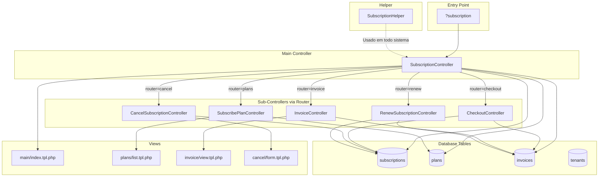
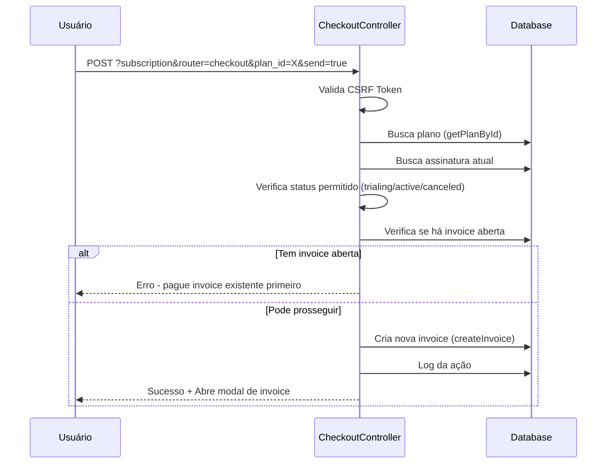
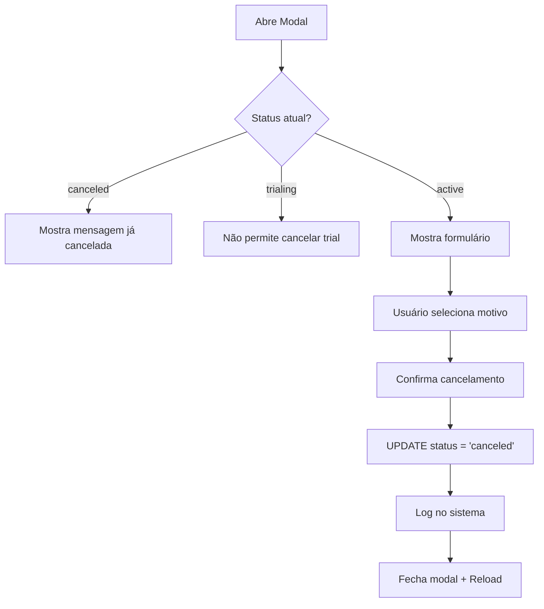
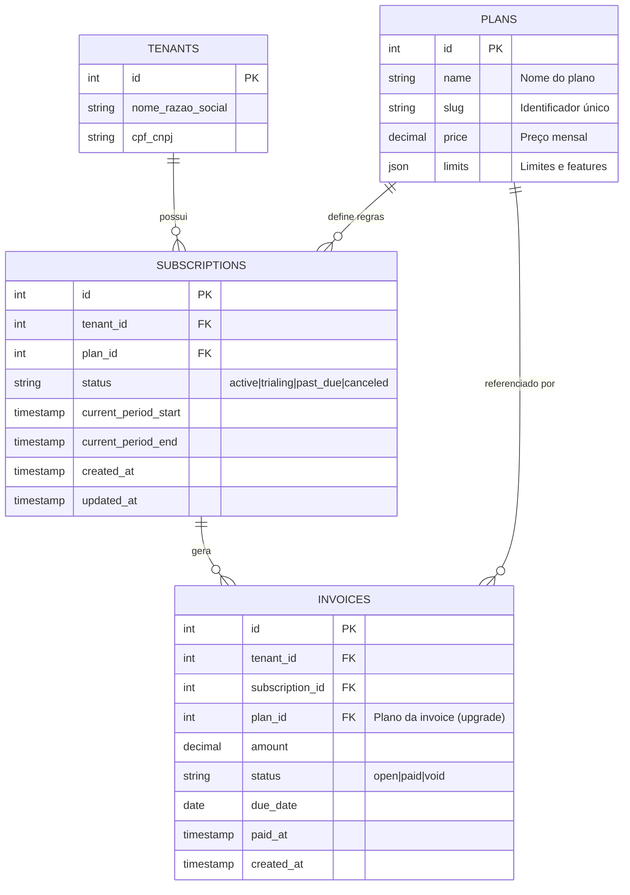
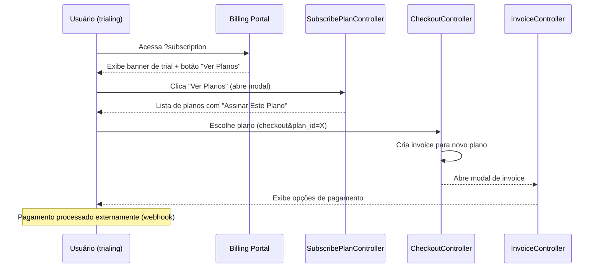
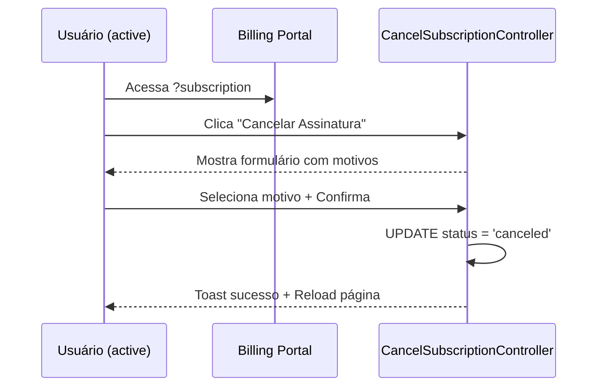
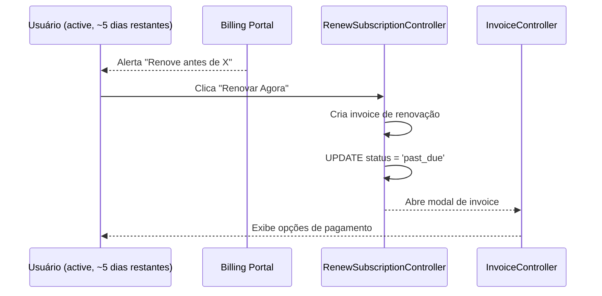
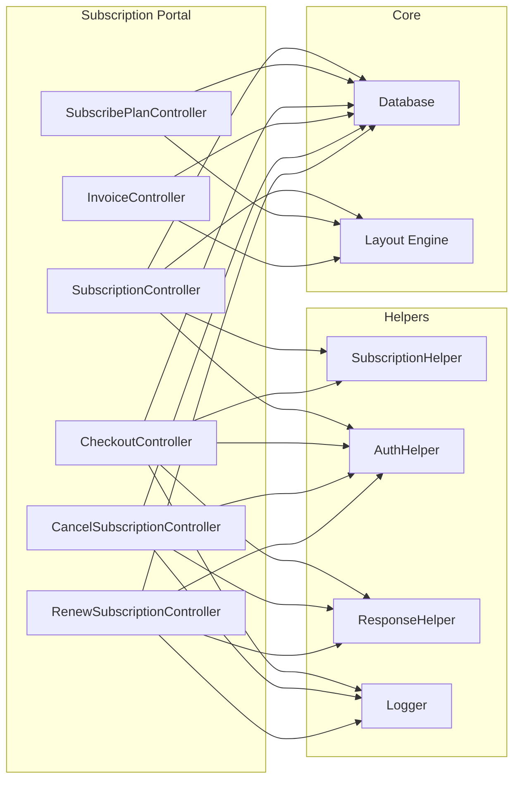

# Portal de Assinaturas - Documentação Técnica

Este documento detalha o funcionamento completo do Portal de Assinaturas (Billing Portal) do VigiaSafra, incluindo arquitetura, fluxos de dados, controllers e suas integrações.

---

## 1. Visão Geral da Arquitetura

O Portal de Assinaturas é acessado via `?subscription` e é composto por um sistema modular de controllers que seguem o padrão **MVC** da plataforma.

### Diagrama de Arquitetura



---

## 2. Estrutura de Arquivos

### Controllers (`application/controllers/Subscription/`)

| Arquivo | Responsabilidade |
|---------|-----------------|
| [SubscriptionController.php](file:///c:/xampp/htdocs/agrotech/application/controllers/Subscription/SubscriptionController.php) | Controller principal - Portal de Cobranças, roteamento e dashboard |
| [SubscribePlanController.php](file:///c:/xampp/htdocs/agrotech/application/controllers/Subscription/SubscribePlanController.php) | Listagem e seleção de planos disponíveis |
| [CheckoutController.php](file:///c:/xampp/htdocs/agrotech/application/controllers/Subscription/CheckoutController.php) | Processamento de checkout (upgrade/conversão de trial) |
| [InvoiceController.php](file:///c:/xampp/htdocs/agrotech/application/controllers/Subscription/InvoiceController.php) | Exibição de faturas individuais |
| [CancelSubscriptionController.php](file:///c:/xampp/htdocs/agrotech/application/controllers/Subscription/CancelSubscriptionController.php) | Formulário e processamento de cancelamento |
| [RenewSubscriptionController.php](file:///c:/xampp/htdocs/agrotech/application/controllers/Subscription/RenewSubscriptionController.php) | Renovação de assinatura ativa/vencida |

### Helper (`application/helpers/`)

| Arquivo | Responsabilidade |
|---------|-----------------|
| [SubscriptionHelper.php](file:///c:/xampp/htdocs/agrotech/application/helpers/SubscriptionHelper.php) | Validação de acesso, feature flags, limites do plano |

### Views (`views/default/subscriptions/`)

| Diretório/Arquivo | Usado por |
|-------------------|-----------|
| [main/index.tpl.php](file:///c:/xampp/htdocs/agrotech/views/default/subscriptions/main/index.tpl.php) | SubscriptionController |
| [plans/list.tpl.php](file:///c:/xampp/htdocs/agrotech/views/default/subscriptions/plans/list.tpl.php) | SubscribePlanController |
| [invoice/view.tpl.php](file:///c:/xampp/htdocs/agrotech/views/default/subscriptions/invoice/view.tpl.php) | InvoiceController |
| [cancel/form.tpl.php](file:///c:/xampp/htdocs/agrotech/views/default/subscriptions/cancel/form.tpl.php) | CancelSubscriptionController |

---

## 3. Sistema de Roteamento

O `SubscriptionController` atua como **gateway central**, roteando requisições para sub-controllers baseado no parâmetro `router`:

```php
private function handleRouter(string $router): void {
    $routes = [
        'cancel'   => 'CancelSubscriptionController',
        'plans'    => 'SubscribePlanController',
        'checkout' => 'CheckoutController',
        'invoice'  => 'InvoiceController',
        'renew'    => 'RenewSubscriptionController',
    ];

    if (isset($routes[$router]) && class_exists($routes[$router])) {
        $controllerClass = $routes[$router];
        new $controllerClass();
    }
}
```

### Mapa de URLs

| URL | Controller Executado | Ação |
|-----|---------------------|------|
| `?subscription` | SubscriptionController | Dashboard principal |
| `?subscription&router=plans` | SubscribePlanController | Lista de planos (modal) |
| `?subscription&router=checkout&plan_id=X&send=true` | CheckoutController | Processa checkout |
| `?subscription&router=invoice&invoice_id=X` | InvoiceController | Exibe fatura (modal) |
| `?subscription&router=cancel` | CancelSubscriptionController | Form cancelamento (modal) |
| `?subscription&router=cancel&send=true` | CancelSubscriptionController | Processa cancelamento |
| `?subscription&router=renew&send=true` | RenewSubscriptionController | Processa renovação |

---

## 4. Detalhamento dos Controllers

### 4.1 SubscriptionController (Principal)

**Arquivo:** [SubscriptionController.php](file:///c:/xampp/htdocs/agrotech/application/controllers/Subscription/SubscriptionController.php)

**Responsabilidades:**
- Renderiza o portal principal de cobranças
- Roteia para sub-controllers
- Carrega dados da assinatura atual
- Carrega histórico de faturas
- Gera HTML dinâmico para diferentes estados

**Métodos principais:**

| Método | Descrição |
|--------|-----------|
| `loadBillingPortal()` | Orquestra carregamento de todos os dados |
| `loadSubscriptionData()` | Busca assinatura atual com JOIN no plano |
| `loadInvoiceHistory()` | Lista últimas 50 faturas do tenant |
| `buildSubscriptionInfoHTML()` | Gera HTML baseado no status (active/trialing/canceled/past_due) |
| `buildPlanDetailsHTML()` | Mostra limites e features do plano atual |
| `buildInvoiceTableHTML()` | Tabela de faturas com ações |

**Tokens enviados à view:**

```php
$this->appLayout->set("SUBSCRIPTION_INFO", $subscriptionInfoHTML);
$this->appLayout->set("PLAN_DETAILS", $planDetailsHTML);
$this->appLayout->set("INVOICE_TABLE", $invoiceTableHTML);
$this->appLayout->set("CSRF_TOKEN", $_SESSION['csrf_token']);
$this->appLayout->set("STATUS", $subscriptionData['status']);
```

---

### 4.2 SubscribePlanController

**Arquivo:** [SubscribePlanController.php](file:///c:/xampp/htdocs/agrotech/application/controllers/Subscription/SubscribePlanController.php)

**Responsabilidades:**
- Lista todos os planos disponíveis ordenados por preço
- Identifica plano atual do usuário
- Renderiza cards de planos com botões contextuais

**Fluxo:**
1. Carrega assinatura atual (`getCurrentSubscription()`)
2. Busca planos (`loadAvailablePlans()`)
3. Gera HTML de cards (`buildPlansHTML()`)

**Lógica de botões:**
```php
if ($isCurrentPlan && !$isTrial && !$isCanceled) {
    // Botão desabilitado "Plano Atual"
} elseif ($isTrial || $isCanceled) {
    // Botão "Assinar Este Plano" (verde)
} else {
    // Botão "Mudar para este Plano" (azul)
}
```

---

### 4.3 CheckoutController

**Arquivo:** [CheckoutController.php](file:///c:/xampp/htdocs/agrotech/application/controllers/Subscription/CheckoutController.php)

**Responsabilidades:**
- Processa conversão de trial para plano pago
- Processa upgrade/downgrade de plano
- Gera invoices para pagamento

**Fluxo de Checkout:**



> [!IMPORTANT]
> O usuário **permanece ativo** no plano atual até que a invoice seja paga. Não há mudança de status imediata.

---

### 4.4 InvoiceController

**Arquivo:** [InvoiceController.php](file:///c:/xampp/htdocs/agrotech/application/controllers/Subscription/InvoiceController.php)

**Responsabilidades:**
- Exibe detalhes de uma fatura específica
- Mostra opções de pagamento
- Valida ownership (tenant_id)

**Query com fallback para plan_id:**
```sql
SELECT 
    COALESCE(i.plan_id, s.plan_id) as plan_id,
    p.name as plan_name
FROM invoices i
JOIN subscriptions s ON i.subscription_id = s.id
JOIN plans p ON p.id = COALESCE(i.plan_id, s.plan_id)
WHERE i.id = ? AND i.tenant_id = ?
```

> [!NOTE]
> A invoice pode ter seu próprio `plan_id` (para upgrades) ou herdar da subscription atual.

---

### 4.5 CancelSubscriptionController

**Arquivo:** [CancelSubscriptionController.php](file:///c:/xampp/htdocs/agrotech/application/controllers/Subscription/CancelSubscriptionController.php)

**Responsabilidades:**
- Exibe formulário de cancelamento
- Coleta motivo do cancelamento
- Processa cancelamento

**Regras de negócio:**
- ❌ Não pode cancelar assinatura em trial
- ❌ Não pode cancelar se já está cancelada
- ✅ Exige motivo de cancelamento

**Fluxo:**


---

### 4.6 RenewSubscriptionController

**Arquivo:** [RenewSubscriptionController.php](file:///c:/xampp/htdocs/agrotech/application/controllers/Subscription/RenewSubscriptionController.php)

**Responsabilidades:**
- Gera invoice de renovação para plano atual
- Permite renovar assinaturas `active` ou `past_due`

**Restrições:**
- ✅ Permite renovar: `active`, `past_due`
- ❌ Bloqueia se já existe invoice aberta
- ⚠️ Muda status para `past_due` até pagamento

---

## 5. SubscriptionHelper

**Arquivo:** [SubscriptionHelper.php](file:///c:/xampp/htdocs/agrotech/application/helpers/SubscriptionHelper.php)

Classe utilitária usada em **todo o sistema** para validação de acesso:

### Métodos

| Método | Uso | Retorno |
|--------|-----|---------|
| `isActive()` | Verifica se assinatura está válida | `bool` |
| `enforceSubscription()` | Middleware de bloqueio | `void` (redireciona se inativo) |
| `hasFeature($slug)` | Verifica feature flag do plano | `bool` |
| `canAdd($usage, $limitKey)` | Verifica limite numérico | `bool` |
| `getDaysRemaining()` | Dias até vencimento | `int` |

### Uso em outros Controllers

```php
// No início de qualquer controller protegido:
SubscriptionHelper::enforceSubscription();

// Verificação de feature:
if (!SubscriptionHelper::hasFeature('can_export_pdf')) {
    exit('Recurso não disponível no seu plano.');
}

// Verificação de limite:
if (!SubscriptionHelper::canAdd($totalUsuarios, 'limit_users')) {
    exit('Limite de usuários atingido.');
}
```

---

## 6. Modelo de Dados

### Diagrama ER Completo



### Status da Subscription

| Status | Significado | Acesso Permitido |
|--------|-------------|------------------|
| `trialing` | Período de teste | ✅ Sim |
| `active` | Assinatura paga ativa | ✅ Sim |
| `past_due` | Pagamento pendente | ⚠️ Limitado (24h tolerância) |
| `canceled` | Cancelada pelo usuário | ❌ Não |

### Status da Invoice

| Status | Significado |
|--------|-------------|
| `open` | Aguardando pagamento |
| `paid` | Paga (atualiza subscription) |
| `void` | Cancelada/Anulada |

---

## 7. Fluxos de Usuário

### 7.1 Trial → Plano Pago



### 7.2 Cancelamento



### 7.3 Renovação



---

## 8. Integração com Outros Controllers

O `SubscriptionHelper` é usado em todo o sistema para controle de acesso:

### Controllers que usam `enforceSubscription()`

Qualquer controller que precise garantir assinatura ativa deve incluir:

```php
public function __construct() {
    AuthHelper::checkLogin(1);
    SubscriptionHelper::enforceSubscription(); // Bloqueia se inativo
    // ... resto do código
}
```

### Controllers que verificam features

```php
// Em DashboardController, ReportsController, etc:
if (SubscriptionHelper::hasFeature('can_export_pdf')) {
    // Mostra botão de exportar PDF
}

if (SubscriptionHelper::hasFeature('can_use_ai')) {
    // Habilita VigiaMind IA
}
```

### Controllers que verificam limites

```php
// Em CamposController (gestão de talhões):
$totalCampos = $this->countCampos($_SESSION['tenant_id']);
if (!SubscriptionHelper::canAdd($totalCampos, 'limit_plots')) {
    exit(ResponseHelper::alert('error', 'Limite de talhões atingido.'));
}
```

---

## 9. Frontend: Modais e JavaScript

O portal usa funções JavaScript globais definidas em `navigation.js` e `ui-controls.js`:

### Funções utilizadas

| Função | Uso |
|--------|-----|
| `openModal(url, title)` | Abre modal e carrega conteúdo via AJAX |
| `closeModal()` | Fecha modal ativo |
| `Open(url, resultDiv, method, data)` | Requisição AJAX para ações (POST) |
| `BuscaElementosForm(formId)` | Serializa formulário para envio |

### Exemplo de uso

```html
<!-- Abrir modal de planos -->
<button onclick="openModal('?subscription&router=plans', 'Escolher Plano')">
    Ver Planos
</button>

<!-- Executar checkout -->
<button onclick="Open('?subscription&router=checkout&plan_id=2&send=true', 'checkout_result', 'POST', '')">
    Assinar Plano
</button>

<!-- Cancelar com formulário -->
<button onclick="Open('?subscription&router=cancel&send=true', 'result_modal', 'POST', BuscaElementosForm('FormCancel'))">
    Confirmar Cancelamento
</button>
```

---

## 10. Segurança

### Validações implementadas

1. **Autenticação**: `AuthHelper::checkLogin(1)` em todos controllers
2. **CSRF**: `AuthHelper::checkCsrfToken()` em todas ações POST
3. **Ownership**: Queries sempre filtram por `tenant_id = $_SESSION['tenant_id']`
4. **Sanitização**: `filter_input()` com filtros apropriados

### Exemplo de validação completa

```php
// No CheckoutController:
AuthHelper::checkLogin(1);

if (!AuthHelper::checkCsrfToken()) {
    exit(ResponseHelper::alert("error", "Token inválido.", 4000));
}

$planId = filter_input(INPUT_GET, 'plan_id', FILTER_VALIDATE_INT);
if (!$planId) {
    exit(ResponseHelper::alert("error", "Plano inválido.", 4000));
}

// Query segura com tenant_id
$sql = "SELECT ... WHERE tenant_id = ?";
$this->query($sql, [$_SESSION['tenant_id']]);
```

---

## 11. Resumo de Dependências



---

## 12. Considerações de Manutenção

### Adicionar novo status de assinatura

1. Definir comportamento no `SubscriptionHelper::isActive()`
2. Adicionar case no `match()` de `buildSubscriptionInfoHTML()`
3. Atualizar condicionais na view `main/index.tpl.php`

### Adicionar novo método de pagamento

1. Implementar integração no `InvoiceController` ou novo controller
2. Atualizar view `invoice/view.tpl.php` com novo botão
3. Implementar webhook para confirmação de pagamento

### Adicionar nova feature ao plano

1. Adicionar no JSON `limits` da tabela `plans`
2. Adicionar label em `getLimitLabel()` dos controllers
3. Usar `SubscriptionHelper::hasFeature('nova_feature')` onde necessário

---

> [!TIP]
> Para debug, ative logs no `Logger` e verifique a tabela `logs` filtrando por categoria "Assinaturas".
