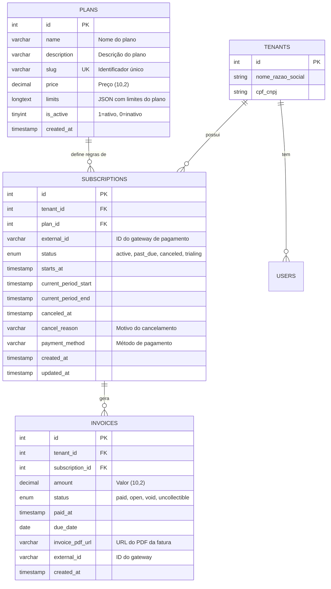

# Sistema de Assinaturas e Cobranças

Este documento detalha a arquitetura, o fluxo de dados e a implementação do sistema de assinaturas.

## 1. Visão Geral

O sistema controla o acesso (SaaS) baseando-se no **status da assinatura** ativa do Tenant (Empresa).
Todo Tenant possui um histórico de assinaturas (`subscriptions`), mas apenas a mais recente é considerada para validação de acesso.

### Principais Componentes:
- **Tenants**: A conta da empresa.
- **Plans**: Definição do produto (nome, preço, limites).
- **Subscriptions**: O vínculo entre Tenant e Plano (tem data de início, fim e status).
- **Invoices**: O registro financeiro (faturas) gerado a partir de uma assinatura.

---

## 2. Banco de Dados e Relacionamentos

### Diagrama ER (Entidade-Relacionamento)



### Detalhes das Tabelas

#### `plans`
Definição dos planos disponíveis para assinatura.

| Campo | Tipo | Nullable | Key | Default | Extra |
|-------|------|----------|-----|---------|-------|
| id | int(11) | NO | PRI | NULL | auto_increment |
| name | varchar(50) | NO | | NULL | |
| description | varchar(255) | NO | | NULL | |
| slug | varchar(50) | NO | UNI | NULL | |
| price | decimal(10,2) | NO | | NULL | |
| limits | longtext | NO | | NULL | |
| is_active | tinyint(1) | YES | | 1 | |
| created_at | timestamp | NO | | current_timestamp() | |

- **slug**: Identificador único legível (ex: `basico`, `pro`, `enterprise`).
- **limits**: JSON com limites operacionais (ex: `{"users": 5, "disk_mb": 500}`).
- **is_active**: Permite desativar planos descontinuados sem removê-los.

#### `subscriptions`
Tabela central que define se o cliente pode acessar o sistema.

| Campo | Tipo | Nullable | Key | Default | Extra |
|-------|------|----------|-----|---------|-------|
| id | int(11) | NO | PRI | NULL | auto_increment |
| tenant_id | int(10) unsigned | NO | | NULL | |
| plan_id | int(11) | NO | MUL | NULL | |
| external_id | varchar(255) | YES | | NULL | |
| status | enum('active','past_due','canceled','trialing') | YES | | active | |
| starts_at | timestamp | YES | | NULL | |
| current_period_start | timestamp | YES | | NULL | |
| current_period_end | timestamp | YES | | NULL | |
| canceled_at | timestamp | YES | | NULL | |
| cancel_reason | varchar(150) | NO | | NULL | |
| payment_method | varchar(50) | YES | | NULL | |
| created_at | timestamp | NO | | current_timestamp() | |
| updated_at | timestamp | NO | | current_timestamp() | on update current_timestamp() |

- **status**:
    - `trialing`: Período de testes (default ao cadastrar).
    - `active`: Assinatura paga e válida.
    - `past_due`: Pagamento falhou ou venceu (bloqueia ou avisa).
    - `canceled`: Cancelada manualmente.
- **external_id**: ID da assinatura no gateway de pagamento (Stripe, PagSeguro, etc).
- **current_period_end**: Data limite do acesso. O `SubscriptionHelper` verifica esta data.
- **canceled_at / cancel_reason**: Registra quando e por que foi cancelada.
- **payment_method**: Método utilizado (ex: `credit_card`, `boleto`, `pix`).

#### `invoices`
Histórico de cobranças.

| Campo | Tipo | Nullable | Key | Default | Extra |
|-------|------|----------|-----|---------|-------|
| id | int(11) | NO | PRI | NULL | auto_increment |
| tenant_id | int(11) | NO | | NULL | |
| subscription_id | int(11) | NO | MUL | NULL | |
| amount | decimal(10,2) | NO | | NULL | |
| status | enum('paid','open','void','uncollectible') | YES | | open | |
| paid_at | timestamp | YES | | NULL | |
| due_date | date | YES | | NULL | |
| invoice_pdf_url | varchar(255) | YES | | NULL | |
| external_id | varchar(255) | YES | | NULL | |
| created_at | timestamp | NO | | current_timestamp() | |

- Uma assinatura gera N faturas ao longo do tempo (renovação mensal/anual).
- **status**:
    - `open`: Aguardando pagamento.
    - `paid`: Paga (deve atualizar a `subscriptions` estendendo o prazo).
    - `void`: Cancelada/Anulada.
    - `uncollectible`: Cobrança impossível (cliente inadimplente).
- **invoice_pdf_url**: Link para download do PDF da fatura.
- **external_id**: ID da fatura no gateway de pagamento.

---

## 3. Implementação no Código

### A. Criação de Assinatura (Cadastro)
Arquivo: `RegisterTenantController.php`

Quando uma empresa se cadastra:
1. O Tenant é criado.
2. O método `createTrialSubscription()` insere uma linha na tabela `subscriptions` com status `trialing` e validade de 15 dias.

```php
// Exemplo de lógica simplificada do RegisterTenantController
$sql = "INSERT INTO subscriptions (tenant_id, plan_id, status, current_period_end) 
        VALUES (?, ?, 'trialing', DATE_ADD(NOW(), INTERVAL 15 DAY))";
```

### B. Validação de Acesso (Login)
Arquivo: `LoginController.php`

Ao logar:
1. O sistema busca a **última assinatura** do Tenant.
2. Faz o JOIN com `plans` para pegar os limites (`limits`).
3. Salva na sessão:
    - `$_SESSION['tenant_plan']`: Dados da assinatura.
    - `$_SESSION['tenant_limits']`: Limites operacionais (ex: máx. usuários).

### C. Bloqueio e Verificação (Helper)
Arquivo: `SubscriptionHelper.php`

Classe utilitária usada em todo o sistema:
- `SubscriptionHelper::isActive()`: Retorna `true` se status for `active`/`trialing` **E** se a data não expirou.
- `SubscriptionHelper::enforceSubscription()`: Redireciona para tela de bloqueio se inativo.
- `SubscriptionHelper::canAdd($uso, 'limite')`: Verifica se o Tenant atingiu o teto do plano.

---

## 4. Exemplo Prático (SQL)

Cenário: A empresa "AgroTech Demo" (ID 10) assinou o plano "Pro" (ID 2). Foi gerada uma fatura de R$ 199,90 que foi paga.

### 1. Inserindo a Assinatura (Ativa)

```sql
INSERT INTO subscriptions (
    tenant_id, 
    plan_id, 
    status, 
    starts_at, 
    current_period_start, 
    current_period_end, 
    created_at, 
    updated_at
) VALUES (
    10, -- Tenant ID
    2,  -- Plan ID (Pro)
    'active', 
    NOW(), -- Começou agora
    NOW(), -- Ciclo atual iniciou agora
    DATE_ADD(NOW(), INTERVAL 30 DAY), -- Vence em 30 dias
    NOW(), 
    NOW()
);
```

Vamos supor que o ID gerado da assinatura acima foi **55**.

### 2. Gerando a Fatura (Invoice) Paga

```sql
INSERT INTO invoices (
    tenant_id,
    subscription_id,
    amount,
    status,
    paid_at,
    due_date,
    created_at
) VALUES (
    10,     -- Mesmo Tenant
    55,     -- Vínculo com a assinatura acima
    199.90, -- Valor
    'paid', -- Já consta como paga
    NOW(),  -- Data do pagamento
    DATE_ADD(NOW(), INTERVAL 3 DAY), -- Vencimento original
    NOW()
);
```

### 3. Integração (O que acontece quando paga?)

Um Webhook (sistema externo de pagamento) receberia a confirmação do pagamento da Invoice. O sistema então deve rodar algo como:

```sql
-- Estender a assinatura por mais 30 dias
UPDATE subscriptions 
SET current_period_end = DATE_ADD(current_period_end, INTERVAL 30 DAY),
    status = 'active'
WHERE id = 55;
```
