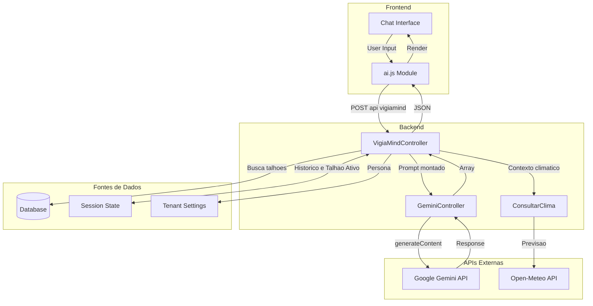
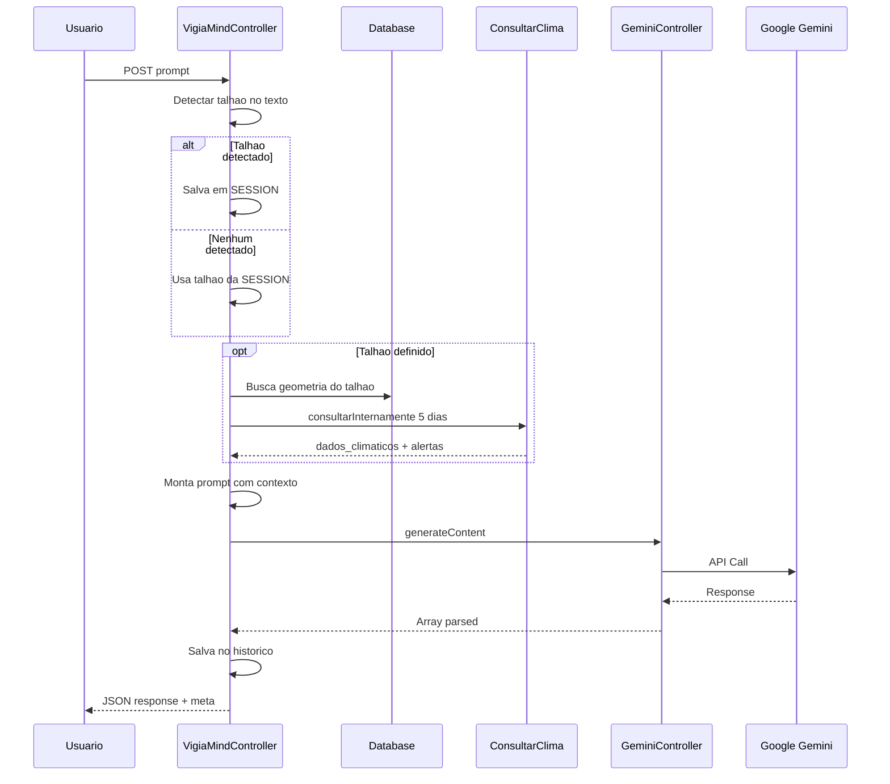
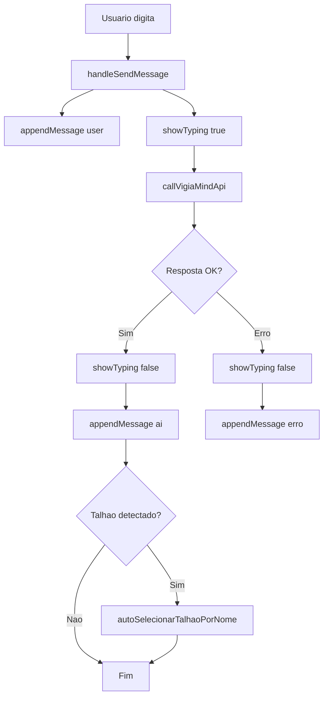
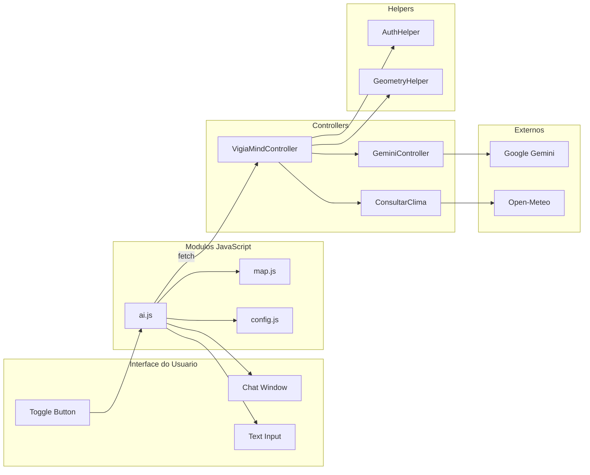
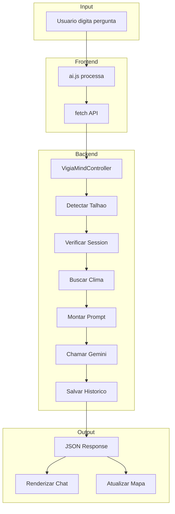

# VigiaMind - Assistente de IA Agrícola - Documentação Técnica

Este documento detalha o funcionamento completo do VigiaMind, o assistente de inteligência artificial agrícola do VigiaSafra, incluindo arquitetura, fluxo de dados, integração com APIs externas e componentes frontend.

---

## 1. Visão Geral da Arquitetura

O VigiaMind é um assistente de IA conversacional que utiliza o Google Gemini para interpretar perguntas do produtor e fornecer recomendações agronômicas contextualizadas com dados climáticos em tempo real.

### Diagrama de Arquitetura



---

## 2. Estrutura de Arquivos

### Backend

| Arquivo | Classe | Responsabilidade |
|---------|--------|-----------------|
| [VigiaMindController.php](file:///c:/xampp/htdocs/agrotech/application/controllers/Api/v1/VigiaMind/VigiaMindController.php) | `VigiaMindController` | Orquestrador principal - contexto, detecção de talhão, prompt |
| [GeminiController.php](file:///c:/xampp/htdocs/agrotech/application/controllers/AI/GeminiController.php) | `GeminiController` | Wrapper da API Google Gemini |
| [ControllerApiClima.php](file:///c:/xampp/htdocs/agrotech/application/controllers/Api/v1/clima/ControllerApiClima.php) | `ConsultarClima` | Dados climáticos com cache |

### Frontend

| Arquivo | Responsabilidade |
|---------|-----------------|
| [ai.js](file:///c:/xampp/htdocs/agrotech/public/assets/js/modules/ai.js) | Módulo JavaScript do chat |
| [config.js](file:///c:/xampp/htdocs/agrotech/public/assets/js/modules/config.js) | URLs e configurações |
| [nova.tpl.php](file:///c:/xampp/htdocs/agrotech/views/default/home/nova.tpl.php) | Template HTML do chat |

### Roteamento

```php
// application/controllers/Api/v1/routes/_task.php
'vigiamind' => 'VigiaMindController'

// URL de acesso
?apiv1&router=vigiamind
```

---

## 3. VigiaMindController - Orquestrador

**Arquivo:** [VigiaMindController.php](file:///c:/xampp/htdocs/agrotech/application/controllers/Api/v1/VigiaMind/VigiaMindController.php)

### 3.1 Variáveis de Sessão

O VigiaMind mantém estado conversacional via sessão:

| Variável | Propósito |
|----------|-----------|
| `$_SESSION['vigiamind_history']` | Histórico de mensagens (user/ai) |
| `$_SESSION['vigiamind_talhao_ativo']` | Talhão em foco na conversa atual |

### 3.2 Fluxo de Processamento



### 3.3 Detecção de Talhão

O sistema detecta automaticamente qual talhão o usuário está mencionando:

```php
private function detectarTalhao($texto) {
    $texto = mb_strtolower($texto);
    
    $sql = "SELECT id, talhao_nome, fazenda_nome, cultura, geometria, 
                   semeadura, prev_colheita, ha 
            FROM talhoes WHERE tenant_id = ? AND lixeira = 0";
    
    // Procura nome do talhão no texto digitado
    while ($row = $this->fetchArray($stmt)) {
        $nomeTalhao = mb_strtolower($row['talhao_nome']);
        if (strpos($texto, $nomeTalhao) !== false) {
            return $row;  // Retorna dados completos do talhão
        }
    }
    return null;
}
```

**Lógica de Persistência:**
1. Se detectou novo talhão → Atualiza SESSION e usa este
2. Se não detectou → Usa talhão da SESSION (memória contextual)
3. Se SESSION vazia → Responde sem contexto específico

### 3.4 Integração Climática

Quando um talhão está ativo, busca dados climáticos:

```php
// Calcula centroide do talhão
$centroide = GeometryHelper::calculateCentroid($talhaoParaUso['geometria']);

// Instancia clima em modo interno (sem HTTP output)
$climaController = new ConsultarClima(false);

$locationsQuery = [[
    'id' => $talhaoParaUso['id'],
    'lat' => $centroide['lat'],
    'lon' => $centroide['lon'],
    'cultura' => $talhaoParaUso['cultura'],
    'semeadura' => $talhaoParaUso['semeadura'],
    'previsao_colheita' => $talhaoParaUso['prev_colheita']
]];

// Busca 5 dias de previsão
$dadosClima = $climaController->consultarInternamente($locationsQuery, 5);
```

**Dados injetados no prompt:**
- `dados_climaticos`: JSON com daily/hourly
- `alertas`: Array de alertas do AnalisadorAgricola

---

## 4. GeminiController - Wrapper da API

**Arquivo:** [GeminiController.php](file:///c:/xampp/htdocs/agrotech/application/controllers/AI/GeminiController.php)

### 4.1 Interface Pública

```php
public function generateContent(string $prompt, string $model = 'gemini-2.0-flash'): array
```

### 4.2 Modelos Disponíveis

| Modelo | Uso no Sistema |
|--------|----------------|
| `gemini-2.0-flash` | Default - respostas rápidas |
| `gemini-2.5-flash-lite` | Usado pelo VigiaMind - otimizado |

### 4.3 Payload da API

```php
$data = [
    'contents' => [
        [
            'role'  => 'user',
            'parts' => [
                ['text' => $prompt]
            ]
        ]
    ]
];
```

### 4.4 Autenticação

- **Endpoint:** `https://generativelanguage.googleapis.com/v1beta/models/{model}:generateContent`
- **Header:** `X-goog-api-key: {API_KEY}`
- **Timeout:** 30 segundos

---

## 5. Sistema de Prompts

### 5.1 Estrutura do Prompt

O prompt é construído dinamicamente com múltiplas seções:

```php
private function construirPromptSistema($userPrompt, $infoTalhao, $dadosClima, $historicoChat) {
    return <<<PROMPT
    Você é o **VigiaMind**, o consultor agronômico digital da plataforma VigiaSafra.
    
    === FUNDAMENTAL: A NATUREZA DOS SEUS DADOS ===
    Você analisa dados de **Modelos Meteorológicos Globais** (GFS/ECMWF).
    REGRA DE OURO: Você lida com PROBABILIDADES, nunca com certezas absolutas.
    
    === SUA PERSONALIDADE ===
    AJUSTE A PERSONALIDADE PARA: {$this->iaPersonality}
    
    === DADOS DO TALHÃO ===
    $infoTalhao
    $dadosClima
    
    === MEMÓRIA DA CONVERSA ===
    $historicoChat
    
    === SITUAÇÃO ===
    Data/Hora: $agora
    Pergunta: "$userPrompt"
    
    Responda ao produtor:
    PROMPT;
}
```

### 5.2 Regras do Sistema de IA

| Regra | Descrição |
|-------|-----------|
| **Probabilístico** | Nunca afirmar "vai chover", usar "os modelos indicam..." |
| **Adaptativo** | Se usuário relata condição diferente, confiar nele |
| **Anti-repetição** | Não se apresentar se já fez no histórico |
| **Leitura técnica** | Buscar dados exatos no array hourly quando perguntado horário específico |

### 5.3 Personas Configuráveis

O VigiaMind adapta seu tom baseado na configuração do tenant:

| Persona | Comportamento |
|---------|--------------|
| `tecnico` | Respostas detalhadas, termos técnicos, foco em dados |
| `executivo` | Direto ao ponto, foco em ação e decisão |
| `didatico` | Explicações passo-a-passo, linguagem acessível |

**Configuração:** `$_SESSION["tenant_settings"]["ai_persona"]`

---

## 6. Frontend - Módulo ai.js

**Arquivo:** [ai.js](file:///c:/xampp/htdocs/agrotech/public/assets/js/modules/ai.js)

### 6.1 Estado do Chat

```javascript
const state = {
    isOpen: false,      // Chat visível
    isThinking: false,  // Aguardando resposta
    isExpanded: false,  // Modo expandido
    messages: []        // Histórico local (UI)
};
```

### 6.2 Elementos da UI

```javascript
const UI = {
    chatContainer: document.getElementById('vigiamind-chat-container'),
    toggleBtn: document.getElementById('vigiamind-toggle-btn'),
    messagesArea: document.getElementById('vigiamind-messages'),
    inputField: document.getElementById('vigiamind-input'),
    sendBtn: document.getElementById('vigiamind-send-btn'),
    closeBtn: document.getElementById('vigiamind-close-btn'),
    expandBtn: document.getElementById('vigiamind-expand-btn'),
    typingIndicator: document.getElementById('vigiamind-typing'),
    mainContent: document.getElementById('main-content')
};
```

### 6.3 Funções Exportadas

| Função | Descrição |
|--------|-----------|
| `init()` | Inicializa módulo e event listeners |
| `toggleChat()` | Abre/fecha o chat |

### 6.4 Fluxo de Mensagem



### 6.5 Integração com Mapa

Quando a IA detecta um talhão, o mapa é atualizado:

```javascript
if (data.meta && data.meta.talhao_detectado) {
    if (typeof window.autoSelecionarTalhaoPorNome === 'function') {
        window.autoSelecionarTalhaoPorNome(data.meta.talhao_detectado);
    }
}
```

### 6.6 Formatação de Respostas

```javascript
function formatResponse(text) {
    // Escape HTML
    let formatted = text.replace(/</g, "&lt;").replace(/>/g, "&gt;");
    
    // **negrito** -> <strong>
    formatted = formatted.replace(/\*\*(.*?)\*\*/g, 
        '<strong class="text-[#367C2B] font-bold">$1</strong>');
    
    // *italico* -> <em>
    formatted = formatted.replace(/\*(.*?)\*/g, 
        '<em class="text-slate-600">$1</em>');
    
    // - lista -> bullet
    formatted = formatted.replace(/^\s*-\s+(.*)$/gm, 
        '<div class="ml-4 flex"><span class="mr-2">•</span><span>$1</span></div>');
    
    return formatted;
}
```

---

## 7. Formato de Resposta da API

### 7.1 Request

```javascript
POST ?apiv1&router=vigiamind

Body:
{
    "prompt": "Como está o tempo no Talhão Norte hoje?"
}
```

### 7.2 Response

```json
{
    "response": "Com base nos modelos meteorológicos, o **Talhão Norte** apresenta condições favoráveis hoje...",
    "meta": {
        "talhao_detectado": "Talhão Norte",
        "usou_memoria": false
    }
}
```

| Campo | Descrição |
|-------|-----------|
| `response` | Texto da resposta da IA |
| `meta.talhao_detectado` | Nome do talhão identificado (ou null) |
| `meta.usou_memoria` | Se usou talhão da sessão anterior |

---

## 8. Controle de Acesso

### 8.1 Autenticação

```php
AuthHelper::checkLogin(1);
```

### 8.2 Permissão de Módulo

```php
if (!AuthHelper::checkModulePermission("aiAgent", "canAccess")) {
    echo json_encode(['error' => 'You do not have permission to use the agent.']);
    exit;
}
```

### 8.3 Feature Flag no Plano

O acesso ao VigiaMind é controlado pelo plano de assinatura:

```php
// Em tenant_limits
'can_use_ai' => true/false
```

---

## 9. Histórico de Conversa

### 9.1 Armazenamento

```php
// Salva após cada interação
$_SESSION['vigiamind_history'][] = ['role' => 'user', 'content' => $userPrompt];
$_SESSION['vigiamind_history'][] = ['role' => 'ai', 'content' => $aiResponse];
```

### 9.2 Limitação de Tokens

```php
// Limita a 6 interações (3 perguntas + 3 respostas)
$historicoRecente = array_slice($historicoChat, -6);
```

### 9.3 Formatação para Prompt

```php
$stringHistorico = "";
foreach ($historicoRecente as $msg) {
    $role = strtoupper($msg['role']);
    $stringHistorico .= "[$role]: {$msg['content']}\n";
}
```

---

## 10. Diagrama de Componentes



---

## 11. Logs e Debug

### 11.1 Arquivo de Log

```php
private $logFile = 'log/vigiamind.json';

private function log($mensagem) {
    file_put_contents($this->logFile, "$mensagem\n", FILE_APPEND);
}
```

### 11.2 Console do Frontend

```javascript
console.log("VIGIAMIND: Initializing...");
console.log(`[VigiaMind] Talhão detectado: ${data.meta.talhao_detectado}`);
console.error("VIGIAMIND Error:", error);
```

---

## 12. Configurações

### 12.1 URL da API (Frontend)

```javascript
// public/assets/js/modules/config.js
export const API_VIGIAMIND_URL = 'http://localhost:8090/agrotech/?apiv1&router=vigiamind';
```

### 12.2 Tenant Settings

```php
$_SESSION["tenant_settings"]["ai_persona"]  // tecnico|executivo|didatico
```

### 12.3 Parâmetros do Modelo

| Parâmetro | Valor |
|-----------|-------|
| Modelo | `gemini-2.5-flash-lite` |
| Timeout | 30 segundos |
| Histórico máx | 6 mensagens |
| Dias de previsão | 5 |

---

## 13. Guia de Manutenção

### Adicionar nova persona

1. Adicionar opção no settings (`views/default/settings/main/index.tpl.php`)
2. Processar no `MainUserSettingsController`
3. O prompt já usa `{$this->iaPersonality}` dinamicamente

### Modificar prompt do sistema

Editar método `construirPromptSistema()` em `VigiaMindController.php`.

Seções disponíveis:
- Regras fundamentais
- Personalidade
- Leitura técnica
- Dados do talhão
- Memória da conversa

### Trocar modelo de IA

```php
// Em VigiaMindController.php linha 148
$response = $gemini->generateContent($systemPrompt, 'gemini-2.5-flash-lite');

// Trocar para:
$response = $gemini->generateContent($systemPrompt, 'gemini-2.0-flash');
```

### Aumentar contexto histórico

```php
// Em VigiaMindController.php
$historicoRecente = array_slice($historicoChat, -6);  // Alterar -6 para mais
```

---

## 14. Fluxo de Dados Completo



---

## 15. Segurança

| Aspecto | Implementação |
|---------|---------------|
| Autenticação | `AuthHelper::checkLogin(1)` |
| Autorização | `AuthHelper::checkModulePermission("aiAgent", "canAccess")` |
| Isolamento | Dados filtrados por `tenant_id` |
| Sanitização | `filter_input()` e escape de HTML no frontend |
| API Key | Armazenada no servidor, nunca exposta ao cliente |

---

> [!TIP]
> Para testar o VigiaMind:
> 1. Verifique se o tenant tem `can_use_ai = true`
> 2. Crie pelo menos um talhão com nome identificável
> 3. No chat, mencione o nome do talhão para ativar contexto
> 4. Logs em `log/vigiamind.json`
